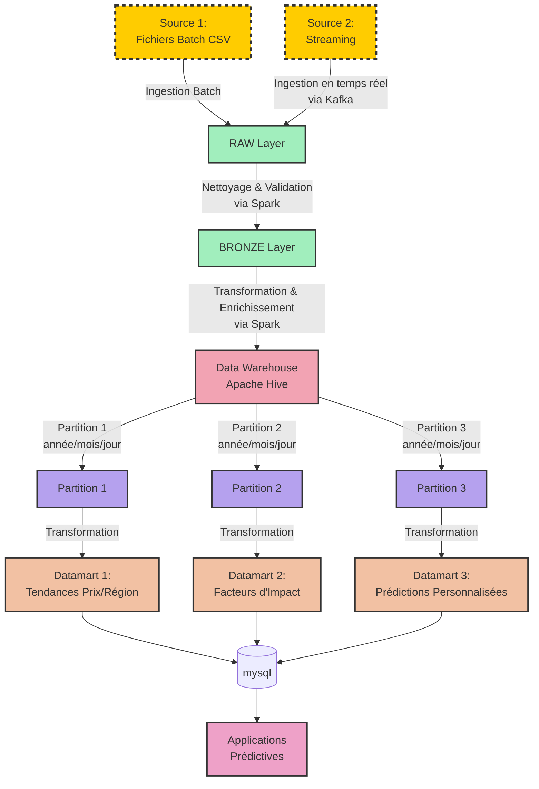

# Architecture du Système de Prédiction de Prix Immobilier

## Schéma d'Architecture



## 1. Sources de Données

### Source 1: Fichiers Batch (CSV)
- **Description**: Fichiers CSV contenant les données immobilières historiques complètes.
- **Mécanisme d'Ingestion**: Chargement batch périodique (quotidien/hebdomadaire) via Apache NiFi.
- **Format**: Fichiers CSV structurés avec en-têtes de colonnes.
- **Exemple de Données**: Id, MSSubClass, MSZoning, LotFrontage, LotArea, etc.

### Source 2: Streaming de Données
- **Description**: Simulation de flux de données en temps réel, ajoutant une nouvelle ligne toutes les 5 secondes.
- **Mécanisme d'Ingestion**: Apache Kafka pour la capture et la gestion des flux de données en temps réel.
- **Traitement**: Spark Streaming pour le traitement en temps réel des données.
- **Format**: Messages JSON contenant les mêmes champs que les fichiers batch.
- **Fréquence**: Une nouvelle propriété immobilière toutes les 5 secondes.

## 2. Couches de Données

### Couche RAW
- **Objectif**: Capture des données brutes sans altération.
- **Format de Stockage**: Parquet avec compression Snappy.
- **Structure**: 
  - `/raw/batch/year=YYYY/month=MM/day=DD/housing_data_YYYYMMDD.parquet`
  - `/raw/streaming/year=YYYY/month=MM/day=DD/hour=HH/housing_stream_YYYYMMDDHH_part-XXXXX.parquet`
- **Schéma**: Identique aux données sources (tous les champs du CSV).
- **Validation**: Aucune transformation, juste conversion de format.
- **Technologies**: Apache Spark pour le traitement des données batch et Spark Streaming pour les données en flux.

### Couche BRONZE
- **Objectif**: Données validées et nettoyées.
- **Format de Stockage**: Parquet avec compression Snappy.
- **Structure**: 
  - `/bronze/year=YYYY/month=MM/day=DD/housing_bronze_YYYYMMDD_part-{1,2,3}.parquet`
- **Schéma**:
  - Tous les champs des données RAW
  - Champs additionnels: 
    - `processing_timestamp`: Horodatage du traitement
    - `source_system`: Batch ou Streaming
    - `data_quality_score`: Score de qualité calculé
- **Transformations**:
  - Conversion des types de données
  - Standardisation des formats
  - Remplacement des valeurs nulles par des valeurs par défaut appropriées
  - Détection et marquage des anomalies
  - Partitionnement en 3 parties pour optimiser la parallélisation
- **Technologies**: Apache Spark pour les transformations et le nettoyage des données.

### Couche SILVER
- **Objectif**: Données normalisées, enrichies et prêtes pour l'analyse.
- **Format de Stockage**: Parquet avec compression Snappy et Delta Lake pour gestion des transactions.
- **Structure**: 
  - `/silver/year=YYYY/month=MM/day=DD/housing_silver_YYYYMMDD_part-{1,2,3}.parquet`
- **Schéma**:
  - Données normalisées (dimensionnelles)
  - Tables principales:
    - `property_details`: Caractéristiques principales des propriétés
    - `location_details`: Informations de localisation
    - `building_features`: Caractéristiques du bâtiment
    - `sale_history`: Historique des ventes
  - Champs calculés: 
    - `age_at_sale`: Âge de la propriété au moment de la vente
    - `total_rooms`: Somme des pièces
    - `price_per_sqft`: Prix au pied carré
- **Transformations**:
  - Normalisation des données
  - Calcul de métriques dérivées
  - Application de règles métier
  - Jointures entre sources de données corrélées
- **Technologies**: Apache Spark pour les transformations et l'enrichissement.

### Couche GOLD
- **Objectif**: Données agrégées et précalculées pour analyse et ML.
- **Format de Stockage**: Parquet avec compression Snappy et Delta Lake.
- **Structure**: 
  - `/gold/year=YYYY/month=MM/day=DD/housing_gold_YYYYMMDD_part-{1,2,3}.parquet`
- **Schéma**:
  - Tables analytiques:
    - `price_trends`: Tendances de prix par région et période
    - `feature_importance`: Importance des caractéristiques sur le prix
    - `price_prediction_features`: Features pour les modèles de prédiction
  - Métriques précalculées:
    - Moyennes mobiles des prix
    - Variations saisonnières
    - Indicateurs de marché
- **Transformations**:
  - Agrégations (moyennes, médianes, min/max)
  - Feature engineering pour ML
  - Calculs statistiques avancés
  - Préparation des données pour visualisation
- **Technologies**: Apache Spark pour les agrégations et les calculs avancés.

## 3. Data Warehouse

### Structure Générale
- **Technologie**: Apache Hive pour le stockage et le requêtage SQL distribué
- **Format de Stockage**: Parquet avec compression Snappy
- **Partitionnement**:
  - Temporel: `/year=YYYY/month=MM/day=DD/`
  - Horizontal: Chaque partition temporelle divisée en 3 partitions (`part-1`, `part-2`, `part-3`) pour optimiser la parallélisation
- **Vues**:
  - `dw_property_sales`: Vue unifiée des ventes de propriétés
  - `dw_property_features`: Vue unifiée des caractéristiques de propriétés
  - `dw_location_metrics`: Vue unifiée des métriques par localisation
  - `dw_time_metrics`: Vue unifiée des métriques temporelles
- **Nombre de Datasets**: 4 datasets principaux (ventes, caractéristiques, localisation, temporel)

## 4. Datamarts (MySQL)

### Configuration MySQL
- **Serveur**: Local
- **Port**: 3306
- **Utilisateur**: tatane
- **Mot de passe**: tatane
- **Base de données**: immobilier_prediction_db (à créer)

### Datamart 1: Analyse des Tendances de Prix par Région
- **Objectif**: Fournir des insights sur les tendances de prix par région et période.
- **Tables**:
  - `dm_regional_price_trends`: Tendances de prix par région et période
  - `dm_neighborhood_comparison`: Comparaison des quartiers
  - `dm_seasonal_patterns`: Patterns saisonniers de prix
- **Structure**:
  ```sql
  CREATE TABLE dm_regional_price_trends (
    region_id INT NOT NULL,
    region_name VARCHAR(100) NOT NULL,
    period_year INT NOT NULL,
    period_month INT NOT NULL,
    avg_price DECIMAL(12,2) NOT NULL,
    median_price DECIMAL(12,2) NOT NULL,
    min_price DECIMAL(12,2) NOT NULL,
    max_price DECIMAL(12,2) NOT NULL,
    price_momentum DECIMAL(5,2) NOT NULL,
    transaction_count INT NOT NULL,
    created_at TIMESTAMP DEFAULT CURRENT_TIMESTAMP,
    last_updated TIMESTAMP DEFAULT CURRENT_TIMESTAMP ON UPDATE CURRENT_TIMESTAMP,
    PRIMARY KEY (region_id, period_year, period_month),
    INDEX idx_region_name (region_name),
    INDEX idx_period (period_year, period_month)
  ) ENGINE=InnoDB;
  ```
- **Indexation**:
  - Clé primaire composée sur `region_id`, `period_year`, `period_month`
  - Index secondaire sur `region_name` pour les recherches par nom
  - Index sur les périodes pour les analyses temporelles
- **Partitionnement MySQL**:
  - Partitionnement par liste sur l'année pour optimiser les requêtes historiques

### Datamart 2: Évaluation des Facteurs d'Impact sur les Prix
- **Objectif**: Analyser l'importance des différentes caractéristiques sur le prix.
- **Tables**:
  - `dm_feature_importance`: Importance des caractéristiques
  - `dm_quality_impact`: Impact des indices de qualité
  - `dm_amenity_premium`: Prime associée aux équipements
- **Structure**:
  ```sql
  CREATE TABLE dm_feature_importance (
    feature_id INT NOT NULL AUTO_INCREMENT,
    feature_name VARCHAR(100) NOT NULL,
    feature_category VARCHAR(50) NOT NULL,
    global_importance_score DECIMAL(5,2) NOT NULL,
    correlation_with_price DECIMAL(4,3) NOT NULL,
    created_at TIMESTAMP DEFAULT CURRENT_TIMESTAMP,
    updated_at TIMESTAMP DEFAULT CURRENT_TIMESTAMP ON UPDATE CURRENT_TIMESTAMP,
    model_version VARCHAR(20) NOT NULL,
    PRIMARY KEY (feature_id),
    UNIQUE INDEX idx_feature_name (feature_name),
    INDEX idx_importance (global_importance_score DESC)
  ) ENGINE=InnoDB;

  CREATE TABLE dm_regional_feature_variation (
    feature_id INT NOT NULL,
    region_id INT NOT NULL,
    importance_score DECIMAL(5,2) NOT NULL,
    created_at TIMESTAMP DEFAULT CURRENT_TIMESTAMP,
    PRIMARY KEY (feature_id, region_id),
    FOREIGN KEY (feature_id) REFERENCES dm_feature_importance(feature_id)
  ) ENGINE=InnoDB;

  CREATE TABLE dm_temporal_feature_variation (
    feature_id INT NOT NULL,
    period_year INT NOT NULL,
    period_quarter INT NOT NULL,
    importance_score DECIMAL(5,2) NOT NULL,
    created_at TIMESTAMP DEFAULT CURRENT_TIMESTAMP,
    PRIMARY KEY (feature_id, period_year, period_quarter),
    FOREIGN KEY (feature_id) REFERENCES dm_feature_importance(feature_id)
  ) ENGINE=InnoDB;
  ```
- **Indexation**:
  - Index primaire sur `feature_id`
  - Index unique sur `feature_name`
  - Index sur `global_importance_score` pour trié par importance
  - Clés étrangères pour maintenir l'intégrité référentielle

### Datamart 3: Prédictions de Prix Personnalisées
- **Objectif**: Stockage des données pour les prédictions personnalisées.
- **Tables**:
  - `dm_prediction_models`: Métadonnées des modèles
  - `dm_prediction_features`: Features importantes pour la prédiction
  - `dm_prediction_results`: Résultats des prédictions
- **Structure**:
  ```sql
  CREATE TABLE dm_prediction_models (
    model_id VARCHAR(36) NOT NULL,
    model_name VARCHAR(100) NOT NULL,
    model_version VARCHAR(20) NOT NULL,
    training_date TIMESTAMP NOT NULL,
    model_params TEXT NOT NULL,
    model_metrics JSON NOT NULL,
    is_active BOOLEAN DEFAULT TRUE,
    created_at TIMESTAMP DEFAULT CURRENT_TIMESTAMP,
    PRIMARY KEY (model_id),
    UNIQUE INDEX idx_model_version (model_version)
  ) ENGINE=InnoDB;

  CREATE TABLE dm_prediction_results (
    prediction_id INT NOT NULL AUTO_INCREMENT,
    property_id INT NOT NULL,
    predicted_price DECIMAL(12,2) NOT NULL,
    prediction_interval_low DECIMAL(12,2) NOT NULL,
    prediction_interval_high DECIMAL(12,2) NOT NULL,
    confidence_score DECIMAL(4,3) NOT NULL,
    model_id VARCHAR(36) NOT NULL,
    prediction_timestamp TIMESTAMP NOT NULL,
    feature_contributions JSON NOT NULL,
    created_at TIMESTAMP DEFAULT CURRENT_TIMESTAMP,
    PRIMARY KEY (prediction_id),
    INDEX idx_property (property_id),
    INDEX idx_timestamp (prediction_timestamp),
    INDEX idx_confidence (confidence_score),
    FOREIGN KEY (model_id) REFERENCES dm_prediction_models(model_id)
  ) ENGINE=InnoDB;
  ```
- **Indexation**:
  - Index primaire sur `prediction_id`
  - Index sur `property_id` pour les recherches par propriété
  - Index sur `prediction_timestamp` pour les recherches temporelles
  - Index sur `confidence_score` pour le filtrage par niveau de confiance
  - Utilisation de JSON pour stocker les contributions des caractéristiques tout en gardant une structure relationnelle

## 5. Flux de Données et Processus

### Ingestion des Données
1. **Source Batch**:
   - Chargement périodique des fichiers CSV via Apache NiFi
   - Conversion en Parquet via Apache Spark
   - Stockage dans la couche RAW avec partitionnement temporel

2. **Source Streaming**:
   - Capture des événements en temps réel (1 entrée/5 secondes) via Apache Kafka
   - Traitement par Spark Streaming avec micro-batching (traitement par mini-lots)
   - Écriture dans la couche RAW avec partitionnement temporel et par heure

### Processus ETL/ELT
1. **RAW → BRONZE**:
   - Validation des schémas avec Apache Spark
   - Nettoyage des données
   - Partitionnement en 3 pour optimiser la parallélisation

2. **BRONZE → SILVER**:
   - Normalisation avec Apache Spark
   - Enrichissement
   - Application des règles métier

3. **SILVER → GOLD**:
   - Agrégations avec Apache Spark
   - Feature engineering
   - Préparation pour l'analyse

4. **GOLD → Data Warehouse**:
   - Organisation en datasets analytiques dans Apache Hive
   - Création de vues métier

5. **Data Warehouse → Datamarts**:
   - Extraction des données pertinentes avec Apache Spark
   - Transformation des données en format compatible avec MySQL
   - Chargement dans MySQL via JDBC connector avec les paramètres:
     ```
     jdbc:mysql://localhost:3306/immobilier_prediction_db
     user: tatane
     password: tatane
     ```

### Orchestration et Planification
- **Batch**: Traitement quotidien (nuit) orchestré par Apache Airflow
- **Streaming**: Traitement continu avec Spark Streaming et fenêtres glissantes
- **Réconciliation**: Processus quotidien pour synchroniser les données batch et streaming

## 6. Considérations Techniques

### Partitionnement
- **Partitionnement Temporel**:
  - Structure: `/year=YYYY/month=MM/day=DD/`
  - Avantages: Facilite la purge des données anciennes, optimise les requêtes par période

- **Partitionnement Horizontal** (3 partitions):
  - **Méthode de répartition**: Distribution basée sur le hachage de l'ID de propriété
    - Partition 1: IDs avec hash % 3 = 0
    - Partition 2: IDs avec hash % 3 = 1
    - Partition 3: IDs avec hash % 3 = 2
  - **Implémentation technique**:
    ```scala
    // Exemple de code Spark pour le partitionnement
    df.repartition(
      expr("pmod(hash(property_id), 3)"),
      col("year"), col("month"), col("day")
    ).write.partitionBy("part", "year", "month", "day")
    ```
  - **Avantages**:
    - Parallélisation des traitements: chaque partition peut être traitée par un executor Spark distinct
    - Équilibrage de charge: distribution uniforme des données
    - Optimisation des jointures: co-partitionnement des tables liées
    - Réduction des contentions: minimisation des goulets d'étranglement I/O

### Optimisation des Performances dans MySQL
- **Partitionnement des Tables**:
  - Partitionnement par RANGE sur les dates pour les données historiques
  - Facilite la purge des données anciennes et l'archivage

- **Indexation**:
  - Index B-tree pour les clés primaires et les recherches exactes
  - Index composites pour les requêtes impliquant plusieurs colonnes
  - Utilisation de EXPLAIN pour optimiser les requêtes

- **Configuration MySQL**:
  - Optimisation de InnoDB buffer pool size pour garder les données actives en mémoire
  - Ajustement des paramètres de cache de requêtes
  - Configuration du pool de connexions pour gérer efficacement les accès concurrents

- **Optimisation au Niveau Application**:
  - Utilisation de requêtes préparées pour réduire le temps de parsing
  - Pagination des résultats pour les grands ensembles de données
  - Mise en cache des requêtes fréquentes

### Sécurité et Gouvernance
- **Chiffrement** des données sensibles
- **Masquage** des informations personnelles
- **Traçabilité** des modifications (audit trail)
- **Gestion des droits d'accès** granulaire

## 7. Technologies Recommandées

- **Ingestion**: 
  - Apache Kafka pour le streaming de données
  - Apache NiFi pour l'ingestion batch

- **Traitement**:
  - Apache Spark pour le traitement batch
  - Spark Streaming pour le traitement en temps réel

- **Stockage**:
  - HDFS ou S3 compatible pour le stockage des données
  - Format de Fichier: Parquet avec Delta Lake

- **Orchestration**:
  - Apache Airflow pour l'orchestration des workflows

- **Data Warehouse**:
  - Apache Hive pour le stockage et l'analyse des données

- **Datamart**:
  - MySQL pour le stockage des datamarts analytiques et prédictifs
  - Paramètres de connexion: localhost:3306, user: tatane, password: tatane

- **Requêtage**:
  - SQL via Hive et Spark SQL
  - SQL standard via MySQL

- **Monitoring**:
  - Prometheus et Grafana pour la surveillance du système
  - MySQL Enterprise Monitor pour la surveillance des performances de la base de données

## 8. Installation et Configuration Initiale

### Configuration de la Base de Données MySQL
1. **Connexion au serveur MySQL**:
   ```bash
   mysql -h localhost -P 3306 -u tatane -p
   # Mot de passe: tatane
   ```

2. **Création de la Base de Données**:
   ```sql
   CREATE DATABASE immobilier_prediction_db CHARACTER SET utf8mb4 COLLATE utf8mb4_unicode_ci;
   USE immobilier_prediction_db;
   ```

3. **Scripts de Création des Tables**:
   - Exécuter les scripts SQL mentionnés dans la section 4 pour créer les structures des datamarts
   - Créer un utilisateur dédié pour les applications si nécessaire

4. **Validation de l'Installation**:
   ```sql
   SHOW TABLES;
   DESCRIBE dm_regional_price_trends;