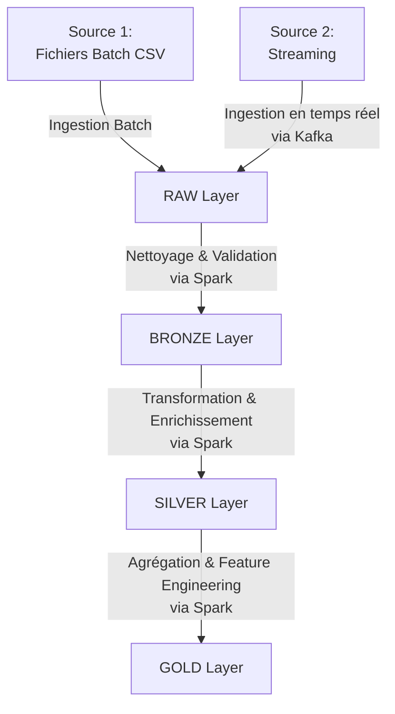

# Processeur de la Couche RAW - Phase 2.1

Ce module implémente le processeur de la couche RAW pour le pipeline de données immobilières.

## Position dans l'Architecture du Système

Ce composant correspond à la **Couche RAW** dans le schéma d'architecture du système de prédiction immobilier:



Nous sommes dans le médaillon **RAW Layer** (R1), qui est responsable de la capture des données brutes sans altération.

## Fonctionnalités

- Récupération des données immobilières depuis les tables MySQL:
  - Données statiques: `proprietes_raw`
  - Données en streaming: `proprietes_raw_streaming`
- Conversion au format Parquet avec compression Snappy
- Structuration selon le partitionnement année/mois/jour
- Création des chemins:
  - `/raw/batch/year=YYYY/month=MM/day=DD/proprietes_raw_YYYYMMDD.parquet`
  - `/raw/streaming/year=YYYY/month=MM/day=DD/hour=HH/proprietes_raw_streaming_YYYYMMDDHHMM.parquet`

## Structure des Fichiers

```
medals/raw/
├── processor.py      # Implémentation principale du processeur RAW
├── run.py            # Script d'exécution du processeur
└── README.md         # Documentation (ce fichier)
```

## Utilisation

Pour exécuter le processeur de la couche RAW:

```bash
python medals/raw/run.py
```

## Phase d'Implémentation

Ce module correspond à la **Phase 2.1** du plan d'implémentation du système de prédiction immobilier.